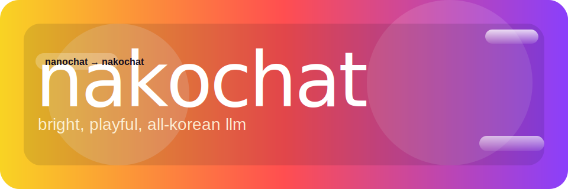

# nakochat



> 매우 작은, 교육용 한국어 ChatGPT 를 훈련해 보세요.

**Andrej Karpathy의 nanochat을 한국어 중심으로 포크한 프로젝트**입니다. 토크나이저 학습 → 프리트레이닝 → 미드트레이닝 → SFT → 평가/서빙까지 한 번에 돌릴 수 있는 작은 코드베이스를 유지하면서, 기본 데이터셋과 스크립트를 한국어에 맞게 수정했습니다.

## 특징
- 한국어 전용 파이프라인: tokenizer/프리트레이닝 데이터는 Hugging Face `minpeter/fineweb-2-edu-korean-raw`(Arrow 샤드) 기반.
- 작은 예산/환경 친화: 단일 GPU에서도 동작하며(느리지만), 원본처럼 8xH100 노드에서도 구동 가능.
- 완전한 오픈 파이프라인: 토크나이저부터 웹UI까지 모든 코드를 직접 수정·확장 가능.
- 원본에 대한 명시: upstream은 Karpathy의 nanochat이며, 이 리포는 한국어 학습을 위한 포크임을 밝힙니다.

## Quick start (speedrun)
한국어 d20(약 5.6억 파라미터) 모델을 학습하는 스크립트:
```bash
bash speedrun.sh
```
- 기본 캐시는 `~/.cache/nanochat_ko`로 분리되어 기존 영어 자산과 충돌하지 않습니다.
- 학습 중 웹UI로 대화하려면 venv 활성화 후 `python -m scripts.chat_web` 실행.
- 단일 GPU에서는 시간이 오래 걸립니다. 다중 GPU라면 `speedrun.sh`의 `NPROC_PER_NODE`를 GPU 수에 맞춰 조정하세요.

## 데이터
- 프리트레이닝: `minpeter/fineweb-2-edu-korean-raw` Arrow 샤드(`data-xxxxx-of-00502.arrow`).
- 토크나이저: 위 한국어 샤드를 일부(빠른 시작용 3개, 추가 50개 등)로 학습.
- SFT: KoAlpaca v1.1 JSONL을 받아 대화 형태로 변환해 사용.
- Mid-training identity: 한국어 페르소나 대화 세트를 자동 생성하여 사용.

## 실행 힌트
- wandb 로깅을 쓰려면 실행 전 `WANDB_RUN=<run_name>` 설정. 기본값 `dummy`는 로깅을 비활성화합니다.
- Arrow/LFS 포인터 문제를 피하려면 데이터셋 다운로드가 끝난 뒤 `.arrow` 파일 크기가 수백 MB인지 확인하세요.
- VRAM이 부족하면 `--device_batch_size`를 줄이고, 토큰 예산(`--target_param_data_ratio` 등)을 조정해 시간을 단축할 수 있습니다.

## Bigger models
d20보다 큰 한국어 모델을 원하면 `speedrun.sh`의 `--depth`, `python -m nanochat.dataset -n ...`, `--device_batch_size`를 조정하세요. 파라미터 수에 비례해 더 많은 샤드를 내려받고, VRAM에 맞춰 배치 크기를 줄이는 방식은 원본 nanochat과 같습니다.

## CPU / MPS
GPU가 없으면 매우 느리지만, `dev/runcpu.sh`를 참고해 배치/토큰 수를 크게 줄이면 코드를 따라가며 실습할 수 있습니다.

## 파일 구조
```
.
├─ README.md
├─ dev/
│   ├─ nakochat.svg           # 밝은 톤의 새 로고
│   └─ ...
├─ nanochat/                  # 모델/데이터/도구 모듈
├─ scripts/                   # speedrun, base_train, mid_train, chat_sft 등
├─ tasks/                     # 평가/학습용 태스크 스크립트
└─ speedrun.sh                # 한국어 d20 학습 파이프라인
```

## Acknowledgements
- Upstream: [karpathy/nanochat](https://github.com/karpathy/nanochat)
- Dataset: HuggingFace FineWeb2 Korean (`minpeter/fineweb-2-edu-korean-raw`)
- KoAlpaca v1.1 for SFT, 한국어 identity 합성 데이터

## License
MIT (원본 라이선스와 동일)
